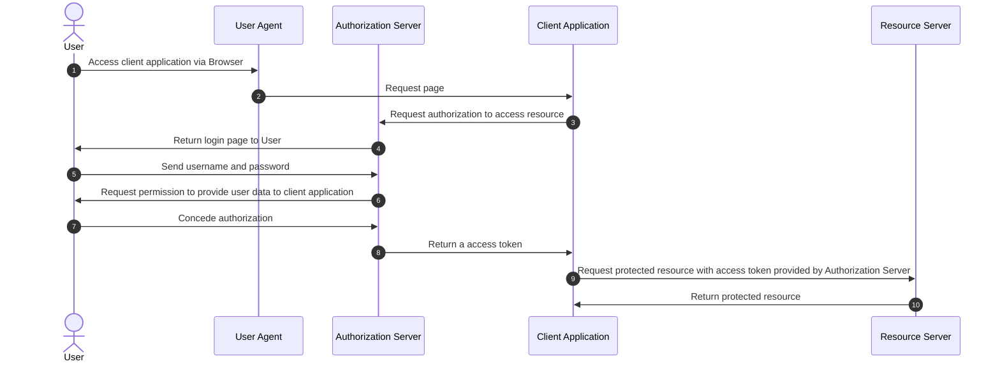

```mermaid

sequenceDiagram
    autonumber

    actor User
    participant User Agent
    participant Authorization Server
    participant Client Application
    participant Resource Server

    User ->> User Agent: Access client application via Browser
    User Agent ->> Client Application: Request page
    Client Application ->> Authorization Server: Request authorization to access resource 
    Authorization Server ->> User: Return login page to User 
    User ->> Authorization Server: Send username and password
    Authorization Server ->> User: Request permission to provide user data to client application
    User ->> Authorization Server: Concede authorization
    Authorization Server ->> Client Application: Return a access token 
    Client Application ->> Resource Server: Request protected resource with access token provided by Authorization Server
    Resource Server ->> Client Application: Return protected resource
```